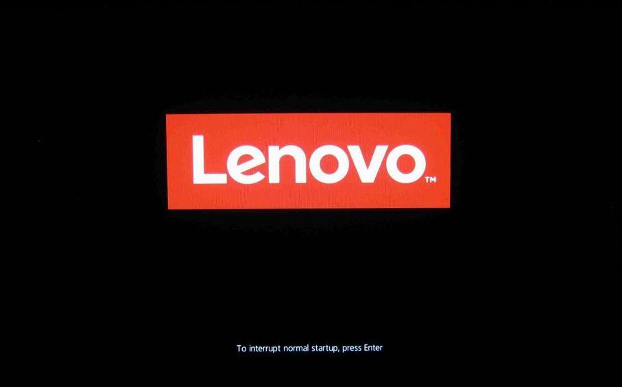
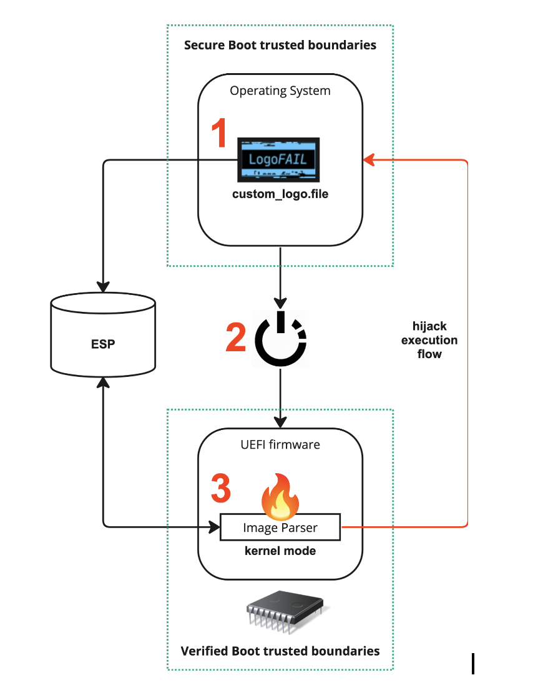

# LogoFAIL

---

### Was passiert, wenn der Computer hochfährt?

1. Pre-EFI Initialization (PEI) Phase
    - Hardware und Speicher werden initialisiert
2. Driver Execution Environment (DXE) Phase
    - Firmware wird geladen und Treiber werden ausgeführt
3. Boot Device Selection and Operating System Loading
    - Das Betriebssystem wird geladen

---

### Wie wird das Hochfahren gesichert?

- Zwischen der DXE Phase und dem Laden des Betriebssystems werden zusätzliche Schritte ausgeführt:
    1. Secure Boot Activation
    2. Bootloader Verification
    3. Chain of Trust

---

### Was macht LogoFAIL?

--

#### Überblick

--

#### Angriff

<iframe width="560" height="315" src="https://www.youtube.com/embed/EufeOPe6eqk?si=59VNQPlV8Zu_SsXN" title="YouTube video player" frameborder="0" allow="accelerometer; autoplay; clipboard-write; encrypted-media; gyroscope; picture-in-picture; web-share" allowfullscreen></iframe>

---